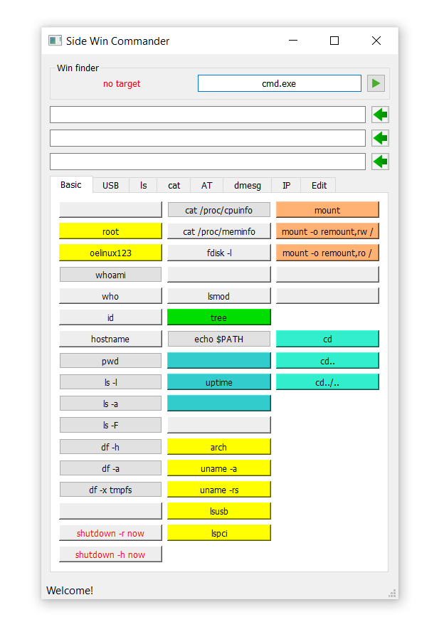

# side_win_commander
This is a program to send text commands to a specific window (another program) in Windows OS simulating keyboard presses.
For example, this program can be used to send commands to any device connected to the computer which uses some special or standard program with GUI.

Before we start sending commands, we need to find the required window (i.e. window of the target application).
The window is searched for by its title or part of the title.
Search pattern (string) should be specified in the form "Win finder" located at the top of the GUI.
If the search is successful, a green text "Target OK" will appear.
After that we can send our text commands to the application.
Each command is ended by 'pressing' Enter key.

